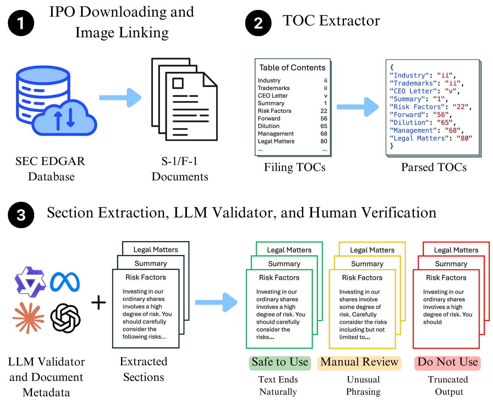

# IPO-Mine: A Toolkit and Dataset for Section-Structured Analysis of Long, Multimodal IPO Documents

[]([https://huggingface.co/datasets](https://huggingface.co/datasets/gtfintechlab/ipo-images))
 [![CC BY 4.0][cc-by-shield]][cc-by]

This work is licensed under a
[Creative Commons Attribution 4.0 International License][cc-by].

## Dataset Construction Pipelines
<table>
    <tr>
        <td>
            Image Dataset Pipeline
        </td>
        <td>
            Text Dataset Pipeline
        </td>
    </tr>
    <tr>
        <td>
            
        </td>
        <td>
            
        </td>
    </tr>
</table>

## Quickstart

### Install from PyPI

```bash
pip install ipo-mine
```

## Using `ipo-mine` to Download an IPO Filing

```python
from download import IPODownloader, Company

downloader = IPODownloader(
    email="example@gmail.com",
    company="Your Example Organization"
)

company = Company.from_ticker("SNOW")

company_filings = downloader.download_ipo(
    company,
    limit=1,
    save_filing=True,
    save_images=False,
    verbose=True
)

filing = company_filings.filings[0]
```

## Parsing the  Table of Contents

```python
results = parser.parse_company(
    ticker="SNOW",
    validate=False
)
```

## Notes

- The SEC requires a descriptive User-Agent. Provide a real organization name and your email.
- `download_ipo` returns a `CompanyFilings` object; use `company_filings.filings[0]` to pass a `Filing` into the parser.
- The parser automatically chooses HTML or text parsing based on the filing URL.


[cc-by]: http://creativecommons.org/licenses/by/4.0/
[cc-by-image]: https://i.creativecommons.org/l/by/4.0/88x31.png
[cc-by-shield]: https://img.shields.io/badge/License-CC%20BY%204.0-lightgrey.svg
